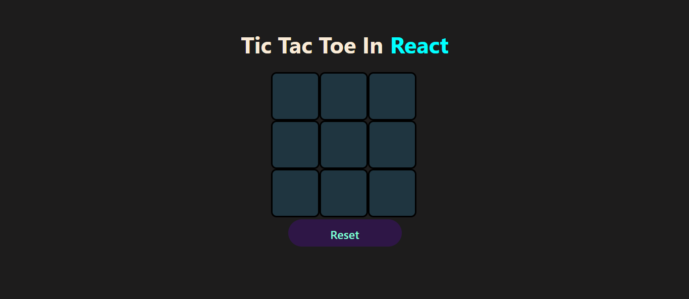

# Tic Tac Toe in React

Welcome to the **Tic Tac Toe** game built with **React**! This project allows players to play Tic Tac Toe with an AI opponent. The AI opponent uses the **Minimax algorithm** to choose the best possible move.

## Features

- **AI Opponent**: Play against the AI that uses the Minimax algorithm to decide the best move.
- **Reset Game**: Reset the game board to start a new game.
- **Win/Draw Detection**: Automatically detects when a player wins or if the game ends in a draw.
- **Responsive**: The game is mobile-friendly and responsive to different screen sizes.

## Preview



## Technologies Used

- **React**: JavaScript library for building user interfaces.
- **CSS**: Styling the app with custom styles.
- **SVG**: Used for rendering the cross (`X`) and circle (`O`) in the game.

## How to Run Locally

To run this project on your local machine, follow these steps:

1. Clone this repository:

    ```bash
    git clone https://github.com/Chiragj2003/tic-tac-toe-react.git
    cd tic-tac-toe-react
    ```

2. Visit `http://localhost:5174` in your browser to play the game.

## How the AI Works

The AI opponent uses the **Minimax algorithm** to determine the best possible move. The algorithm recursively evaluates the game board and chooses the move that maximizes the AI's chances of winning while minimizing the player's chances.

### Steps for AI Move:

1. The AI simulates all possible moves and evaluates them.
2. It then picks the best move based on the Minimax algorithm.
3. After making a move, the AI will wait for the player to make their move before it proceeds.

## Game Flow

1. Players alternate turns. The first player uses **X**, and the second player (AI) uses **O**.
2. Each player clicks a cell to make their move. The game automatically checks for a winner after each move.
3. If a player wins, a congratulations message is displayed.
4. If there is no winner and the board is full, it’s a draw.
5. Players can reset the game anytime using the **Reset** button.

## Folder Structure

- **App.js**: Main entry point for the React application.
- **TicTacToe.js**: The main component that contains the game logic.
- **TicTacToe.css**: Contains the CSS styles for the game.
- **/assets**: Stores the images or assets used in the game (e.g., `circle.png` and `cross.png`).

## License

This project is licensed under the MIT License - see the [LICENSE](LICENSE) file for details.

---

Feel free to contribute to this project or report issues. Enjoy playing Tic Tac Toe!
